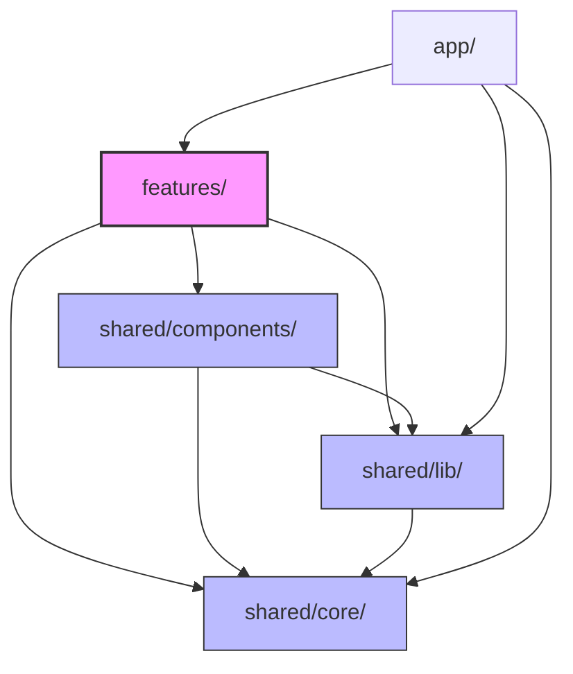

# despy — Project Design Document

> **despy** is an agentic coding evaluation platform designed to assess a student's ability to guide AI assistants to solve programming challenges under constrained resources (message limits, token quotas, and model restrictions).

---

## 1. Project Overview

In a world where AI code generators are ubiquitous, `despy` shifts the focus from pure syntax writing to **AI orchestration**. 
- **The Professor** defines coding tasks, target rubrics, test suites, and strict AI access policies (e.g., Gemini model constraints, maximum tokens, and chat limits).
- **The Student** solves the task inside a sandbox environment, interacting with the AI assistant.
- **The Platform** evaluates the student's process and output through automatic tests and qualitative AI rubrics.

---

## 2. Technical Stack

| Category | Technology |
|---|---|
| **Framework** | Next.js 15 (App Router), React 19, TypeScript |
| **Styling** | styled-components (CSS-in-JS) |
| **State Management** | Zustand (Client state persistence) & TanStack Query (Server state) |
| **Editor** | Monaco Editor (`@monaco-editor/react`) |
| **Sandbox Environment** | WebContainer API (`@webcontainer/api`) — Browser-based Node.js runtime |
| **AI Integration** | Vercel AI SDK (`ai` + `@ai-sdk/google` for Gemini) |
| **Testing Frame** | Vitest, testing-library, happy-dom (within WebContainer) |
| **Lint & Quality** | ESLint (with `import/no-restricted-paths` boundary checks), Vitest |

---

## 3. Architecture & Dependency Rules

The project strictly follows a **feature-based** structure with unidirectional layout boundaries to ensure clean code separation.



### Unidirectional Import Rules
Import boundaries are enforced via `eslint.config.mjs` through custom `import/no-restricted-paths` rules:
- `features/` modules **CAN** import from `shared/*`.
- `shared/` modules **MUST NOT** import from `features/` (to prevent cyclic/reverse dependency).
- Features **MUST NOT** cross-import each other (e.g., `features/author` cannot import `features/solve`).

---

## 4. Key Systems & Data Flows

### A. Real-time AI Code Mirroring (HMR Flow)
When the student chats with the AI assistant, code blocks generated by the AI are extracted in real-time and written directly into the WebContainer virtual file system, triggering Vite's Hot Module Replacement (HMR).

```
[AI Stream /api/agent]
       │
       ▼
(extractStreamingCodeBlock) ──► write to Monaco / workspaceState
       │
       ▼
[useWorkspace.writeFile] ──► debounce (250ms) ──► [fileSync.ts]
       │
       ▼
[WebContainer FS] ──► [Vite Dev Server (within Browser)] ──► [Iframe HMR Preview]
```

*Key files:*
- [markdownCode.ts](file:///C:/Users/John/Desktop/Projects/Hackathon_Despy/src/shared/lib/utils/markdownCode.ts) — Code block extractor
- [fileSync.ts](file:///C:/Users/John/Desktop/Projects/Hackathon_Despy/src/shared/lib/webcontainer/fileSync.ts) — Debounced FS writer
- [runtime.ts](file:///C:/Users/John/Desktop/Projects/Hackathon_Despy/src/shared/lib/webcontainer/runtime.ts) — WebContainer runtime manager

---

### B. In-browser Testing Sandbox
Unit tests run directly in the browser via Vitest within the WebContainer sandbox. 

```
[Student triggers runTests]
       │
       ▼
[runtime.spawn: npx vitest run --reporter=json]
       │
       ▼
[testRunner.ts] ──► Parse stdout JSON ──► [AutoTestResult]
       │
       ▼
[WorkspacePanel.tsx] (Render test tabs and status)
```

*Key files:*
- [testRunner.ts](file:///C:/Users/John/Desktop/Projects/Hackathon_Despy/src/shared/lib/webcontainer/testRunner.ts) — Test execution parser

---

### C. Qualitative Grading System (P3 / P5 Hybrid)
The evaluation system grades student submissions using a weighted hybrid score composed of:
1. **Auto-test completion rate** (extracted from the browser execution).
2. **AI Rubric scoring** (evaluated on the server using structured Gemini outputs).

```
[Student Submission]
       │
       ▼
[POST /api/grade] ──► Validates request payload
       │
       ├─► [geminiGrader.ts] ──► Evaluates user code against rubric
       │                         (Generates JSON structured scores & comments)
       │
       └─► [score.ts] ──► Combines Auto-test rate + Rubric scores
                                 using weights (computeFinalScore)
       │
       ▼
[ChallengeGradingResultPanel.tsx] (Renders final report to Student/Professor)
```

For **Algorithm Coding Tasks** (P5), the code is not executed on the server. Instead, [/api/grade/algorithm](file:///C:/Users/John/Desktop/Projects/Hackathon_Despy/src/app/api/grade/algorithm/route.ts) utilizes LLM qualitative reasoning to grade structural correctness against test cases, making server-side code execution runners (like Judge0) unnecessary.

*Key files:*
- [route.ts](file:///C:/Users/John/Desktop/Projects/Hackathon_Despy/src/app/api/grade/route.ts) — Main challenge grading endpoint
- [geminiGrader.ts](file:///C:/Users/John/Desktop/Projects/Hackathon_Despy/src/shared/lib/grader/geminiGrader.ts) — Gemini structured output rubric assessor
- [score.ts](file:///C:/Users/John/Desktop/Projects/Hackathon_Despy/src/shared/lib/grader/score.ts) — Weighted scoring engine
- [requestValidation.ts](file:///C:/Users/John/Desktop/Projects/Hackathon_Despy/src/shared/lib/grader/requestValidation.ts) — Grader request schema guard

---

## 5. State Management & Storage Strategy

We isolate client-only configuration states from server-persisted caching payloads:

1. **Zustand Persistence (Client & Session Stores)**:
   - [challengeStore.ts](file:///C:/Users/John/Desktop/Projects/Hackathon_Despy/src/shared/core/stores/challengeStore.ts) — Stores problem definitions, templates, rubrics, and AI policies. Keys: `despy-challenges`.
   - [workspaceStore.ts](file:///C:/Users/John/Desktop/Projects/Hackathon_Despy/src/shared/core/stores/workspaceStore.ts) — Manages workspace files, locking states, and active tabs. Backed by **IndexedDB** using `idbStorage` wrapper (`despy-workspace`).
   - [problemStore.ts](file:///C:/Users/John/Desktop/Projects/Hackathon_Despy/src/shared/core/stores/problemStore.ts) — Standard algorithm challenges. Keys: `despy-problems`.
   - [solveSessionStore.ts](file:///C:/Users/John/Desktop/Projects/Hackathon_Despy/src/shared/core/stores/solveSessionStore.ts) — Active session configurations, remaining AI quota tokens, and chat logs. Keys: `despy-solve-session`.

2. **React Query (TanStack Query)**:
   - Used for mutation-based API requests such as sending messages (`/api/agent`) and submitting files for grading (`/api/grade`).

---

## 6. Directory Map & Key Modules

```
src/
├── app/                              # Next.js App Router (View routing & API endpoints)
│   ├── api/grade/route.ts            # Project workspace rubric grading handler
│   ├── api/grade/algorithm/route.ts  # Algorithm AI qualitative grading handler
│   └── api/agent/route.ts            # AI streaming helper (Gemini proxy)
│
├── features/                         # Core product domain modules
│   ├── author/                       # Professor dashboards for challenge & rubric creation
│   └── solve/                        # Student playground, workspace, and AI panel
│
└── shared/                           # Shared infrastructure
    ├── core/                         # Global domain schemas, query setups, and stores
    ├── lib/                          # WebContainer runtime & LLM grading drivers
    ├── components/                   # Core reusable styled ui components
    └── providers/                    # React Context providers (theme, queries)
```

---

## 7. Developer Guides & QA Gates

- **Local Development**:
  Ensure you copy `.env.example` into `.env.local` and set `GEMINI_API_KEY`.
- **Quality Verification**:
  Run these checks before submitting PRs:
  ```bash
  npm run typecheck    # Validate typescript types without emitting files
  npm run lint         # Enforce code styling & layer boundaries
  npm run test         # Run unit tests using Vitest
  ```
- **Key Project Rules**:
  Refer to [CLAUDE.md](file:///C:/Users/John/Desktop/Projects/Hackathon_Despy/CLAUDE.md) for style compliance rules, and [conventions.md](file:///C:/Users/John/Desktop/Projects/Hackathon_Despy/docs/conventions.md) for comprehensive structural guides.
