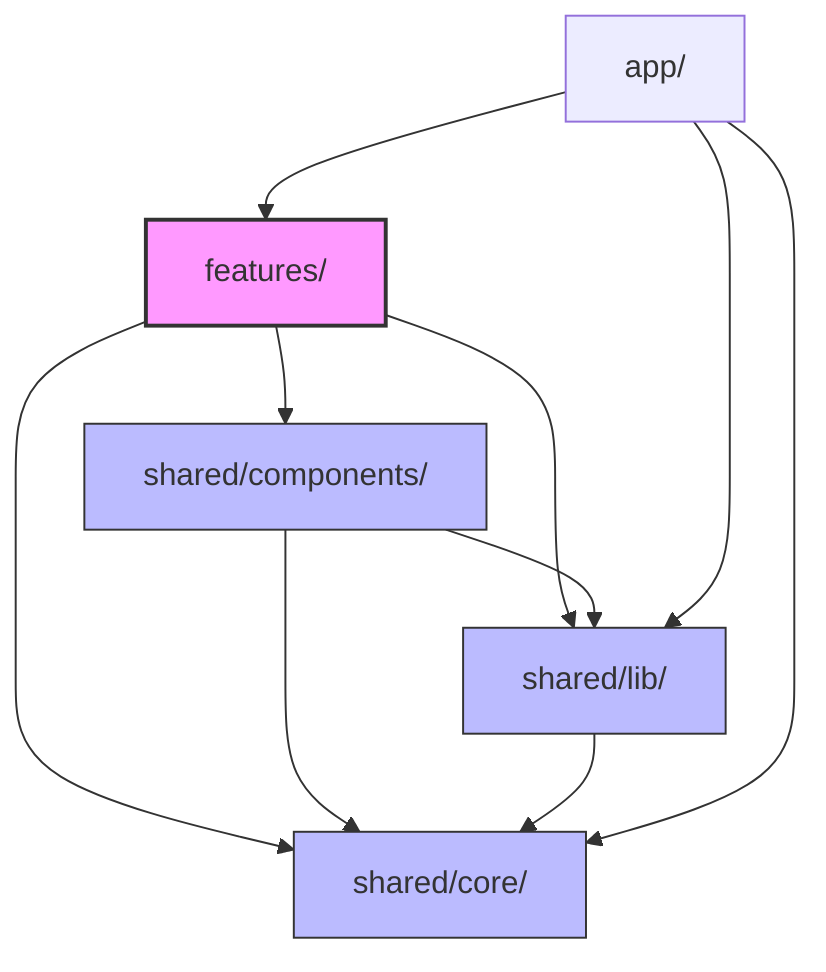

# Despy

> **Agentic Coding Evaluation Platform**  
> 🏆 **2026 Hackathon - Winner of the Encouragement Award (장려상)**

In an era where AI coding assistants (such as GitHub Copilot and ChatGPT) have become industry standards, `despy` shifts the focus of software education from simple syntax memorization and typing speed to precisely evaluating a developer's **"AI Orchestration & Prompting Ability"**—the skill of effectively directing, constraining, and collaborating with autonomous AI agents.

Professors configure tasks alongside specific AI access policies (e.g., fixed models, query limits, token quotas per turn, and custom system prompts). Students solve these challenges inside a real-time Node.js virtual runtime environment running directly in the browser, strategically budgeting their AI resources ("Vibe Coding"). Submissions are graded using a hybrid model combining automated hidden unit tests and AI-powered qualitative rubrics.

---

## 🌟 Key Features

### 1. Practical Web Workspace (WebContainer Sandbox)
* **In-Browser Node.js Runtime**: Uses the WebContainer API (`@webcontainer/api`) to boot up an entire Node.js runtime inside the user's browser, eliminating the need for expensive and slow server-side sandboxing infrastructures. Dependencies are installed (`npm install`), development servers are run, and HMR (Hot Module Replacement) previews are rendered entirely inside a sandboxed iframe in the browser.
* **Real-time AI Code Mirroring (AI Direct Edit)**: Parses markdown code blocks (```) in real-time from streaming AI assistant answers. Code generated by the AI is automatically typed into the Monaco Editor and written to the virtual file system, prompting Vite's hot reloading immediately.
* **Cross-Origin Browser Console Bridge**: Solves the security restriction of cross-origin iframes (`*.webcontainer.io`) by dynamically injecting a forwarding proxy script. This captures preview console logs and runtime errors and pipes them directly to the custom "Browser Console" UI tab.
* **In-Sandbox Unit Testing**: Runs Vitest, Testing Library, and happy-dom directly inside the browser-based WebContainer sandbox, enabling instantaneous unit testing feedback loops for students.

### 2. AI Resource Quota Enforcement & Control (Quota Meter)
* Enforces constraints set by the professor (e.g., max question count and token budgets). A real-time **Quota Meter** shows remaining resources.
* Visual warnings trigger at 70% and 90% utilization. Chat inputs are disabled once the quota is depleted, assessing the student's resource efficiency.

### 3. Server-side Hybrid Grading & Scoring Integrity
* **2-Axis Hybrid Grading**: Combines automated test suite pass rates (by injecting a hidden test fileset `testFiles` during submission) with AI qualitative grading. The AI grader assesses compliance with rubric criteria using structured JSON schemas (Gemini API structured output via the Vercel AI SDK).
* **Security & Scoring Boundaries**: To prevent client-side score manipulation, all final scores, rubric calculations, and weight balances are computed exclusively on the server (`shared/lib/grader/score.ts`).
* **AI Qualitative Grading for Algorithmic Tasks**: Algorithmic challenges are assessed via LLM reasoning against test cases, removing the need for heavy sandbox code runners (like Judge0).

### 4. In-Browser TensorFlow.js ML Challenges
* **Pure JS Machine Learning Environment**: Overcomes the lack of Python packages inside WebContainer by supporting pure TensorFlow.js ML challenge types.
* **Holdout Metric Scoring**: Students construct neural network architectures (`model.mjs`) with AI assistance. Upon submission, hidden test sets are injected to measure classification accuracy or regression RMSE metrics.

### 5. Production-Ready Authentication & Storage
* **JWT + HttpOnly Cookie Sessions**: Edge Middleware (`proxy.ts`, Next.js 16 proxy convention) secures pages and APIs against XSS/CSRF attacks.
* **Role-Based Access Control (RBAC)**: Segregates user permissions into Student (`student`), Professor (`professor`), and Admin (`admin`) levels.
* **IndexedDB Delta Storage**: Workspaces, files, AI query limits, and current progress are automatically cached in the browser's native IndexedDB (`despy-workspace`) to prevent data loss on page reloads.

---

## 🛠 Technical Stack

| Layer | Technologies |
|---|---|
| **Framework** | Next.js 15/16 (App Router), React 19, TypeScript |
| **Styling** | styled-components (CSS-in-JS) |
| **State** | Zustand (Client & Workspace Persistence) & TanStack Query v5 (Server State) |
| **Sandbox** | WebContainer API (`@webcontainer/api`) |
| **Editor** | Monaco Editor (`@monaco-editor/react`) |
| **AI Integration** | Vercel AI SDK (`ai` + `@ai-sdk/google` for Gemini) |
| **Database** | MongoDB Atlas (User account persistence) |
| **Auth** | JWT (`jose`), Password Hashing (`bcryptjs`), HttpOnly Cookies |
| **Testing** | Vitest, happy-dom (running inside WASM Node runtime) |

---

## 📐 Architecture & Conventions

### 1. Real-Time Code Sync Flow (HMR Flow)
AI proxy streaming or student modifications follow a unidirectional write flow where the editor buffer is the single source of truth:

```
[AI Stream /api/agent]
       │
       ▼
(extractStreamingCodeBlock) ──► Monaco Editor & workspaceState Updated
       │
       ▼
[useWorkspace.writeFile] ──► debounce (250ms) ──► [fileSync.ts]
       │
       ▼
[WebContainer Virtual FS] ──► [Vite Dev Server (WASM-based)] ──► [Iframe Preview HMR]
```

### 2. Unidirectional Import Rules
The project enforces a strict **feature-based** directory boundary. These restrictions are checked at build time using ESLint's `import/no-restricted-paths`.



* **Allowed**: `features/` and `app/` routes can import from `shared/*`.
* **Prohibited**: Modules under `shared/*` must never import from `features/*`. Dependency inversion is resolved using callbacks/props injection.
* **Prohibited**: Features must not import from other features (e.g., `features/author` cannot import `features/solve`).

---

## 📂 Directory Structure

```
src/
├── app/                              # Next.js App Router (Routing and API Routes)
│   ├── api/auth/                     # Sign Up, Login, Logout JWT sessions
│   ├── api/admin/                    # User management & role assignment API
│   ├── api/agent/                    # Gemini streaming proxy & token usage limits
│   ├── api/challenges/               # Challenge CRUD & submissions
│   └── api/grade/                    # AI rubric grading & algorithmic assessment
│
├── features/                         # Domain-specific feature slices (Isolated modules)
│   ├── admin/                        # User role elevation views
│   ├── auth/                         # Email/password authentication views
│   ├── author/                       # Professor dashboard (Challenge creation, rubrics)
│   ├── solve/                        # Student workspace (Statement - Chat - Code/Preview)
│   └── mypage/                       # Score metrics and submission history
│
└── shared/                           # Shared infrastructure layers
    ├── core/                         # Global types, Zustand stores, Query hooks, Constants
    ├── lib/                          # Auth utilities, MongoDB connections, WebContainer drivers, grading logic
    └── components/                   # Core styled-components (Button, Panel, Modal, QuotaMeter, etc.)
```

---

## ⚡ Getting Started

### 1. Environment Configurations
Create a `.env.local` file by copying the template:

```bash
cp .env.example .env.local
```

Key required variables:
* `GEMINI_API_KEY`: API Key for AI chat & qualitative grading ([Google AI Studio](https://aistudio.google.com/apikey))
* `MONGODB_URI`: MongoDB Atlas connection string for user persistence
* `MONGODB_DB_NAME`: Database identifier (e.g., `despy`)
* `JWT_SECRET`: Secure secret key used to sign session cookies
* `ADMIN_SEED_EMAIL`, `ADMIN_SEED_PASSWORD`: Credentials for the initial administrator account

### 2. Dependency Installation & Development Server
```bash
# Install packages
npm install

# Run local Next.js dev server with Turbopack
npm run dev
```
Open `http://localhost:3000` on your browser.
> **Note (Cross-Origin Isolation)**: Since WebContainer requires SharedArrayBuffer, COOP and COEP headers are applied globally. Ensure any external CDN resources or fonts comply with CORS policies.

### 3. Seed Initial Administrator Account
Users registering via the sign-up page are assigned the `student` role by default. To create the first administrator account that can assign roles, run the seed script:
```bash
npm run seed:admin
```

### 4. Verification & Testing
Before committing changes, ensure your code passes our quality gates:
```bash
npm run typecheck    # Validate TypeScript declarations without compiling
npm run lint         # Enforce coding styles and unidirectional boundaries
npm run test         # Run unit tests via Vitest
```

---

## 📄 Documentation Mapping
For detailed specifications and architectural reviews, check the files inside the `docs/` directory:

* 📝 [architecture.md](./docs/architecture.md): MVP communication contracts and Token Quota sequences
* 📝 [spec-webcontainer.md](./docs/spec-webcontainer.md): In-browser Node.js runtime and HMR sync specifications
* 📝 [spec-ml-challenge.md](./docs/spec-ml-challenge.md): TensorFlow.js in-browser ML challenge structure and evaluation scoring
* 📝 [spec-production-v1.md](./docs/spec-production-v1.md): Real-world JWT cookie auth patterns and RBAC gates
* 📝 [conventions.md](./docs/conventions.md): JSDoc standards and code layering conventions
* 📝 [CLAUDE.md](./CLAUDE.md): Quick-reference developer map and persistent key registers
