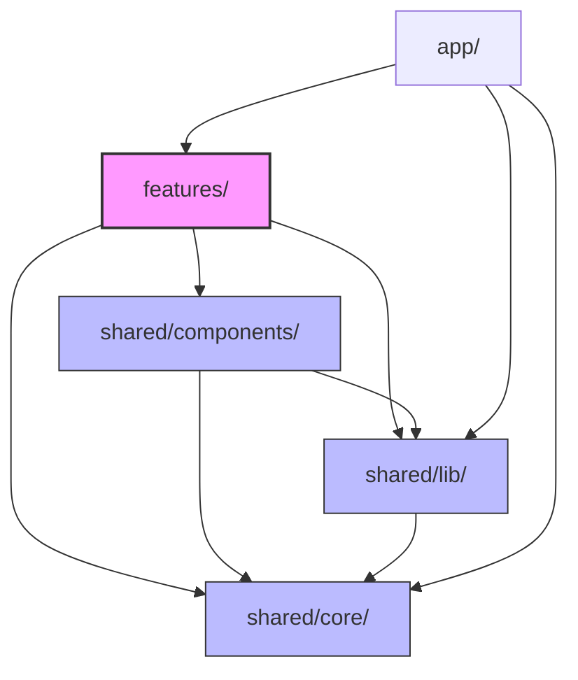

# 🚀 despy (Despy)

> **에이전틱 코딩 평가 시스템 (Agentic Coding Evaluation Platform)**  
> 🏆 **2026 해커톤 장려상 수상작**

AI 코딩 도구(GitHub Copilot, ChatGPT 등)가 개발의 표준이 된 시대에서, 단순한 구문 암기와 타이핑 능력을 평가하는 대신 **AI 에이전트를 효과적으로 지시하고 통제하는 "AI 오케스트레이션(Orchestration) 능력"**을 정밀하게 평가하는 혁신적인 웹 서비스입니다. 

교수는 문제와 함께 AI 정책(특정 모델 고정, 질문 횟수 한도, 대화 턴당 토큰 사용량, 시스템 프롬프트)을 정의하여 출제하고, 학생은 브라우저에 통합된 가상 Node.js 런타임 환경에서 제한된 AI 자원을 전략적으로 활용하여 코드를 작성 및 테스트(바이브 코딩)합니다. 최종 제출물은 AI 정성 평가와 자동화된 테스트 통과 지표가 결합된 하이브리드 방식으로 채점됩니다.

---

## 🌟 핵심 기능 (Key Features)

### 1. 실무형 웹 과제 풀이 워크스페이스 (Web Workspace)
* **인브라우저 가상 Node.js 런타임 (WebContainer)**: WebContainer API (`@webcontainer/api`)를 사용하여 서버측 샌드박스 인프라를 구축할 필요 없이 브라우저 내에서 직접 Node.js 환경을 구동합니다. 의존성 설치(`npm install`), 개발 서버 구동 및 HMR(Hot Module Replacement) 미리보기 iframe을 브라우저 안에서 전부 처리합니다.
* **실시간 AI 코드 미러링 (AI Direct Edit)**: AI 도우미가 답변을 작성할 때 생성되는 마크다운 코드 블록(```)을 실시간 스트리밍 청크 단위를 기반으로 파싱합니다. AI가 작성하는 코드는 실시간으로 Monaco Editor 및 가상 파일 시스템에 직접 작성(Typing)되어 HMR을 통해 미리보기 화면으로 즉각 반영됩니다.
* **크로스 오리진 콘솔 브릿지 (Console Bridge)**: 가상 런타임 iframe과 호스트 웹앱이 cross-origin으로 격리되어 있어 로그 수집이 불가능한 한계를 극복하기 위해, 프리뷰 로드 전용 포워딩 스크립트를 동적으로 주입하여 컨테이너 내부의 `console.log` 및 런타임 에러를 캡처해 브라우저 콘솔 탭에 실시간으로 표시합니다.
* **가상 환경 내 단위 테스트**: 컨테이너 샌드박스 내부에서 Vitest + Testing Library + happy-dom 환경을 구축해, 학생이 개발 중에 즉각 단위 테스트를 돌려보고 통과율을 확인할 수 있는 즉각적인 피드백 루프를 지원합니다.

### 2. AI 리소스 Quota 제어 및 정책 통제 (AI Policy Quota Control)
* 교수가 설정한 제한 사항(질문 횟수 및 토큰 한도)에 따라 학생 화면에 실시간으로 잔여 자원을 보여주는 **Quota Meter**가 연동됩니다.
* 사용량이 임계치(70% 경고, 90% 위험)에 다다르면 시각적인 피드백을 전달하며, 한도를 모두 소진하면 채팅 입력창이 강제 비활성화되어 리소스의 전략적 배분 능력을 평가합니다.

### 3. 하이브리드 채점 & 점수 무결성 (Server-side Hybrid Grading)
* **2축 하이브리드 채점**: WebContainer 내부에서 실행한 비공개 테스트 파일(`testFiles`) 통과율(객관 점수)과 Gemini 구조화 출력(zod 대신 Vercel AI SDK의 `jsonSchema` 활용)을 통해 채점 루브릭을 준수했는지 확인하는 AI 정성 점수를 가중합(Weighted sum)하여 산출합니다.
* **보안 신뢰 경계 확보**: 클라이언트에서 점수를 위조하여 전송하는 것을 차단하기 위해, 최종 합산 점수 계산 및 루브릭 개수 매핑과 정밀 연산은 온전히 서버 가드레일(`shared/lib/grader/score.ts`) 내에서 이루어집니다.
* **알고리즘 문제 AI 정성 판정**: 알고리즘 코딩 테스트의 경우, 무거운 서버 측 실행기(예: Judge0) 없이도 AI의 고도화된 정성 추론을 기반으로 테스트 케이스 정답성 및 정밀 채점을 수행합니다.

### 4. 브라우저 내 TensorFlow.js 기반 ML 챌린지
* **Pure JS 머신러닝 환경**: WebContainer 환경의 제약으로 Python 패키지 실행이 불가능한 점을 극복하기 위해 pure TensorFlow.js 기반의 ML 과제 유형을 지원합니다.
* **Holdout 지표 자동 채점**: 분류(Accuracy) 또는 회귀(RMSE) 프리셋 문제를 푸는 모델 코드(`model.mjs`)를 개발하고 나면, 채점 시점에 숨겨진 테스트셋을 컨테이너 내에 주입하여 도출된 지표를 바탕으로 성능 합격 여부를 판정합니다.

### 5. 실서비스 전환을 위한 프로덕션 인프라 토대
* **JWT + HttpOnly Cookie 세션**: Edge Middleware(`proxy.ts`, Next.js 16 proxy 컨벤션)와 결합해 토큰 탈취 우려(XSS)를 최소화한 인증 구조를 가집니다.
* **역할 기반 접근 제어 (RBAC)**: 학생(`student`), 교수(`professor`), 관리자(`admin`) 역할을 구분해 라우트와 API 레벨에서 완벽하게 접근 권한을 게이팅합니다.
* **IndexedDB Delta Storage**: 매 새로고침 시 가상 파일 시스템이 휘발되는 문제를 방지하기 위해, 템플릿 코드 대비 변경된 파일의 델타(Delta) 버퍼와 AI 잔여 한도 및 진행 상태를 브라우저 내 네이티브 IndexedDB(`despy-workspace`)에 영속적으로 자동 저장 및 로드합니다.

---

## 🛠 기술 스택 (Technical Stack)

| 레이어 | 기술 스택 |
|---|---|
| **Framework** | Next.js 15/16 (App Router), React 19, TypeScript |
| **Styling** | styled-components (CSS-in-JS) |
| **State** | Zustand (Client & Workspace Persistence) & TanStack Query v5 (Server State) |
| **Sandbox** | WebContainer API (`@webcontainer/api`) |
| **Editor** | Monaco Editor (`@monaco-editor/react`) |
| **AI SDK** | Vercel AI SDK (`ai` + `@ai-sdk/google` Gemini API 연동) |
| **Database** | MongoDB Atlas (사용자 계정 정보 영속화) |
| **Auth** | JWT (`jose`), Password Hashing (`bcryptjs`), HttpOnly Cookies |
| **Testing** | Vitest, happy-dom (WASM Node 런타임 내에서 구동) |

---

## 📐 시스템 아키텍처 & 레이어 규칙 (Architecture & Conventions)

### 1. 실시간 코드 동기화 (HMR Flow)
AI 프록시 스트리밍 또는 학생의 직접 편집 동작 시 데이터는 아래와 같은 동기화 파이프라인을 탑니다. 에디터 버퍼를 단일 진실 공급원(Single Source of Truth)으로 삼아 컨테이너 FS 단방향 쓰기 방식을 사용합니다.

```
[AI Stream /api/agent]
       │
       ▼
(extractStreamingCodeBlock) ──► Monaco 에디터 반영 & workspaceState 갱신
       │
       ▼
[useWorkspace.writeFile] ──► debounce (250ms) ──► [fileSync.ts]
       │
       ▼
[WebContainer 가상 FS] ──► [Vite Dev Server (WASM 기반)] ──► [미리보기 Iframe HMR]
```

### 2. 단방향 레이어 의존성 (Unidirectional Import Boundary)
프로젝트는 기능별 결합도를 낮추고 유지보수성을 극대화하기 위해 **Feature-based** 구조를 채택하였으며, 단방향 레이어 규칙을 강제합니다. 이 규칙은 `eslint.config.mjs` 내의 `import/no-restricted-paths` 설정을 통해 빌드 시 엄격히 체크됩니다.



* **허용**: `features/` 및 `app/` 라우트는 `shared/*` 하위 모듈을 가져올 수 있습니다.
* **금지**: `shared/` 레이어 내부의 컴포넌트나 유틸리티는 절대 `features/` 의존성을 직접 가져올 수 없습니다. 의존성 역전이 필요할 경우 Props 또는 콜백 주입 패턴을 활용합니다.
* **금지**: `features/` 간의 직접적인 교차 참조는 제한됩니다 (예: `features/author`에서 `features/solve` 직접 임포트 금지).

---

## 📂 디렉토리 구조 (Directory Map)

```
src/
├── app/                              # Next.js App Router (라우팅 및 API 라우트 핸들러)
│   ├── api/auth/                     # 회원가입, 로그인, 로그아웃 JWT 인증 처리
│   ├── api/admin/                    # 사용자 목록 조회 및 역할(Role) 변경 API
│   ├── api/agent/                    # AI 스트리밍 프록시 & 토큰 카운터 계층
│   ├── api/challenges/               # 과제(Web/ML) 생성, 조회, 수정, 삭제 및 제출 API
│   └── api/grade/                    # AI 루브릭 정성 채점 및 알고리즘 채점 핸들러
│
├── features/                         # 도메인 기반 기능 슬라이스 (독립 모듈)
│   ├── admin/                        # 사용자 역할 변경 대시보드 뷰
│   ├── auth/                         # 이메일/패스워드 기반의 가입 및 로그인 화면
│   ├── author/                       # 교수 문제 출제, 루브릭 설계, 채점 대시보드 도구
│   ├── solve/                        # 학생 3열 풀이 워크스페이스 (지문, AI 채팅, 가상 에디터)
│   └── mypage/                       # 풀이 히스토리 및 제출 성적 분석 차트 뷰
│
└── shared/                           # 애플리케이션 공통 공유 인프라
    ├── core/                         # 데이터 타입(TypeScript), 전역 stores, React Query 훅, 공통 상수
    ├── lib/                          # 인증, MongoDB 싱글턴, WebContainer 런타임 제어 및 채점 비즈니스 로직
    └── components/                   # 재사용 가능한 UI 아토믹 요소들 (Button, Panel, Markdown, QuotaMeter)
```

---

## ⚡ 빠른 시작 (Getting Started)

### 1. 환경 변수 설정
프로젝트 루트 경로에 `.env.example`을 참고하여 `.env.local` 파일을 생성합니다.

```bash
cp .env.example .env.local
```

필수 환경 변수 명세:
* `GEMINI_API_KEY`: Gemini API 호출 및 채점 연동 키 ([Google AI Studio](https://aistudio.google.com/apikey))
* `MONGODB_URI`: 사용자 정보 저장을 위한 MongoDB Atlas 주소
* `MONGODB_DB_NAME`: 데이터베이스 식별자 (예: `despy`)
* `JWT_SECRET`: Edge 호환 jose 서명에 사용할 임의의 안전한 비밀키
* `ADMIN_SEED_EMAIL`, `ADMIN_SEED_PASSWORD`, `ADMIN_SEED_NAME`: 관리자 시드 생성을 위한 계정 정보

### 2. 패키지 설치 및 개발 환경 실행
```bash
# 의존성 설치
npm install

# Next.js 로컬 개발 서버 실행 (Turbopack 활성화)
npm run dev
```
브라우저에서 `http://localhost:3000`으로 접속이 가능합니다.
> **중요 (Cross-Origin Isolation)**: WebContainer는 SharedArrayBuffer를 사용하므로 앱의 모든 응답에 COOP/COEP 헤더가 필수로 설정됩니다. 외부 CDN 리소스나 폰트가 차단되지 않도록 CORS 구성을 점검해 주세요.

### 3. 최초 관리자 계정 생성 (Seed)
회원가입한 사용자는 기본적으로 학생(`student`) 역할이 부여됩니다. 문제를 출제하고 역할을 승격시킬 권한이 있는 최초의 관리자 계정을 시드 스크립트를 통해 생성합니다.
```bash
npm run seed:admin
```

### 4. 정적 분석 및 테스트
커밋이나 PR 제출 전에 품질 가이드를 체크합니다. (Husky/lint-staged가 프리커밋 단계에서 자동 실행합니다.)
```bash
npm run typecheck    # 빌드 결과 배출 없이 TypeScript 형식 점검
npm run lint         # 코드 린터 및 레이어 의존성 제한 규칙 검사
npm run test         # Vitest 전체 유닛 테스트 스위트 실행
```

---

## 📄 라이선스 & 문서 일치 규칙
이 프로젝트에 기여하거나 코드를 수정할 때 [CLAUDE.md](./CLAUDE.md)의 convention 지침 및 `docs/` 내 설계 사양을 항상 동기화해야 합니다.

* [architecture.md](./docs/architecture.md): MVP 시스템 통신 계약 및 토큰 Quota 차감 시퀀스 설명
* [spec-webcontainer.md](./docs/spec-webcontainer.md): WebContainer Sandbox 및 HMR 동기화 런타임 설계 사양
* [spec-ml-challenge.md](./docs/spec-ml-challenge.md): TensorFlow.js 연계 브라우저 머신러닝 과제 및 평가 체계 명세
* [spec-production-v1.md](./docs/spec-production-v1.md): 실서비스 배포 및 JWT/HttpOnly 쿠키 기반 인증/인가 가이드라인
* [conventions.md](./docs/conventions.md): JSDoc 작성 기준 및 레이어 간 코딩 컨벤션 약속
* [CLAUDE.md](./CLAUDE.md): 개발자 및 AI 에이전트를 위한 핵심 도메인 맵과 단일 원칙 요약
